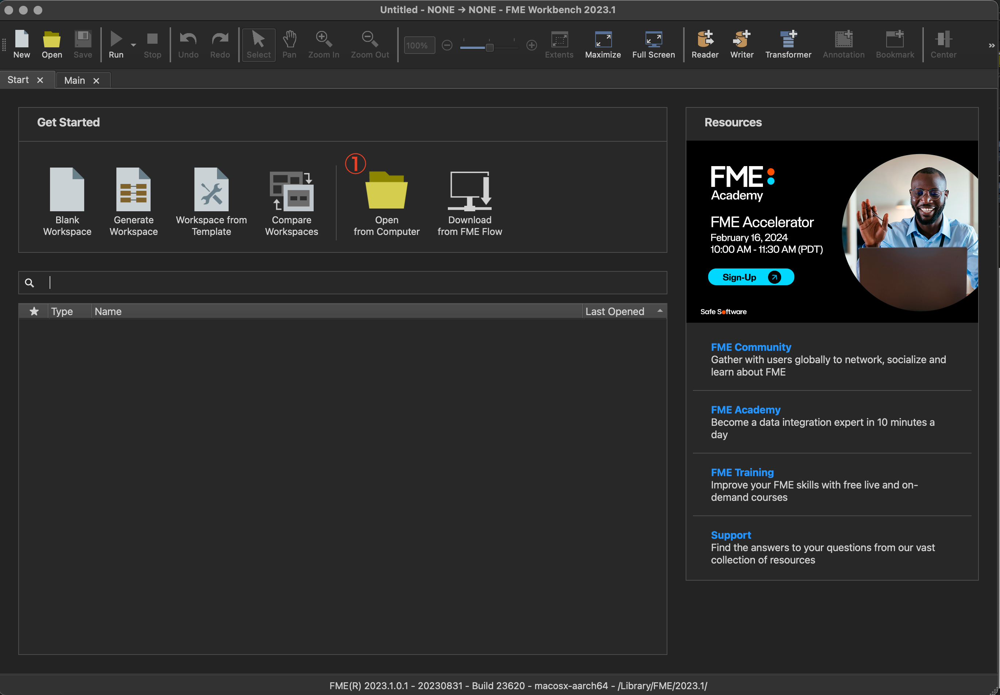
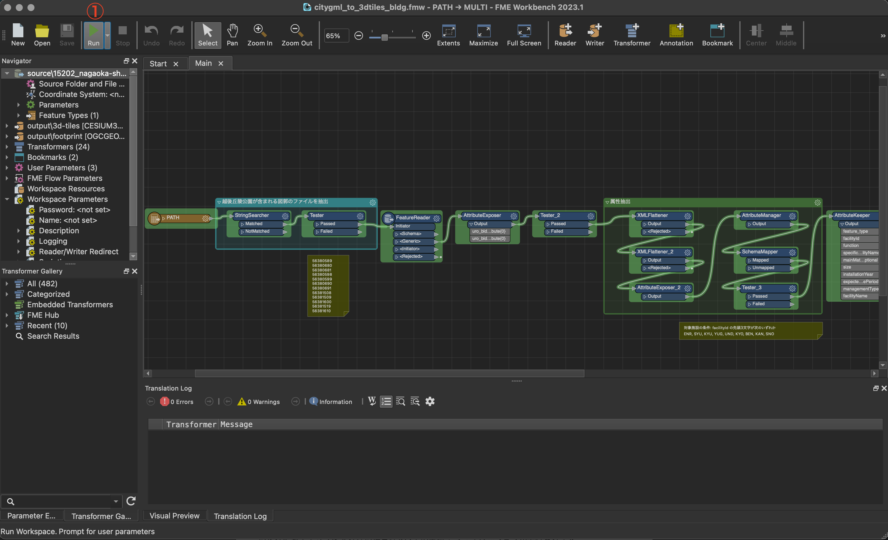
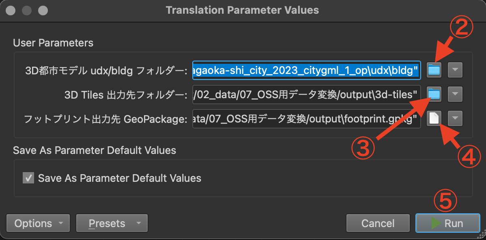

# 操作マニュアル

# 1 本書について

本書では、公園管理システム用CityGML変換ツール（以下「本変換ツール」という。）の操作手順について記載しています。

# 2 使い方

## 2-1 FME Formの起動

本変換ツールは、FME FormのFME Workbench（ワークベンチ）で実行します。FME Workbenchを実行すると以下の画面が表示されます。

①ワークスペースの読み込み
本リポジトリのworkspace/以下に格納されたワークスペース（.fmw）ファイルを選択します。

| | ファイル名 | 処理対象                 |
| -------- | -------------------- | ----------------------------------------------------------- |
| 1        | citygml_to_3dtiles_bldg.fmw         | 3D都市モデル（CityGML）建築物モデル                                                     |
| 2        | citygml_to_3dtiles_brid.fmw     | 3D都市モデル（CityGML）橋梁モデル                         |
| 3        | citygml_to_3dtiles_frn.fmw | 3D都市モデル（CityGML）都市設備モデル                    |
| 4        | citygml_to_3dtiles_wtr.fmw       | 3D都市モデル（CityGML）水部モデル |
| 5        | citygml_to_mvt_area.fmw       | 3D都市モデル（CityGML）区域モデル |
| 6        | citygml_to_mvt_trk.fmw       | 3D都市モデル（CityGML）徒歩道モデル |
| 7        | obj_to_3dtiles_fence_gate_signboard.fmw       | 3D都市モデル（CityGML）都市設備モデル、GISデータ、柵・門・看板の3Dモデル（OBJ） |
| 8        | obj_to_3dtiles_solitary_tree.fmw       | 単独木の3Dモデル（OBJ）、植物管理台帳、3D都市モデル（CityGML）植生モデル |
| 9        | photo_and_label_czml.fmw       | ①〜⑧で作成したフットプリントGeoPackageデータ、写真 |

 

## 2-2 ワークスペースの実行

① 実行

・「Run」ボタンを押下するとファイル/フォルダ選択のダイアログが表示され、入力データ、出力先を指定するウィンドウが開きます。

② 入力データ（ディレクトリ）の指定

・変換元のデータ（CityGML、Obj, gdb）を指定します。このワークスペースばローカルに置かれたファイルを参照するように設定されていますが、リモートのAmazon Simple Storage Servideなどを参照する場合は、参照先を適宜変更してください。

③ 出力先ディレクトリの指定1

・3D TIles, MVT, CZMLの出力先を指定します。このワークスペースばローカルのディレクトリを参照するように設定されていますが、リモートのAmazon Simple Storage Servideなどを参照する場合は、参照先を適宜変更してください。

④ 出力先ディレクトリの指定2

・フットプリントデータ（GPKG）の出力先を指定します。このワークスペースばローカルのディレクトリを参照するように設定されていますが、リモートのAmazon Simple Storage Servideなどを参照する場合は、参照先を適宜変更してください。

⑤ 実行

・②〜④で入出力データの指定が完了したら、「Run」ボタンを押下して、ワークスペースを実行します。

# 3 出力データ

各ワークフローを実行して出力されるデータは以下のとおりです。

| ワークフロー名 | 出力データ | 内容                                                                                                   | データ形式 |
| ------------ | ------------------ | ------------------------------------------------------------------------------------------------------ | ---------- |
| citygml_to_3dtiles_bldg.fmw                 | ../output/3d-tiles/bldg/                                  |  建築物モデルに含まれる公園施設の可視化用3D Tiles           | 3D Tiles   |
|                 | ../output/footprint.gpkg                                  |  建築物モデルに含まれる公園施設のフットプリント           | GeoPackage    |
| citygml_to_3dtiles_brid.fmw | ../output/3d-tiles/brig/                       | 橋梁モデルに含まれる公園施設の可視化用3D Tiles     | 3D Tiles        |
| | ../output/footprint.gpkg                        | 橋梁モデルに含まれる公園施設のフットプリント     | GeoPackage        |
| citygml_to_3dtiles_frn.fmw | ../output/3d-tiles/frn/                     |  都市設備モデル（DM属性で記述されている柵・門・看板を除く）に含まれる公園施設の可視化用3D Tiles| 3D Tiles        |
| | ../output/footprint.gpkg                     | 都市設備モデル（DM属性で記述されている柵・門・看板を除く）に含まれる公園施設のフットプリント | GeoPackage        |
| citygml_to_3dtiles_wtr.fmw | ../output/3d-tiles/wtr/ | 水部モデルに含まれる公園施設の可視化用3D Tiles                         | 3D Tiles    |
| | ../output/footprint.gpkg  | 水部モデルに含まれる公園施設のフットプリント                         | GeoPackage    |
| citygml_to_mvt_area.fmw | ../output/mvt/area/ | 区域モデルに含まれる公園施設の可視化用MVTデータ                           | MVT    |
| | ../output/footprint.gpkg | 区域モデルに含まれる公園施設のフットプリント                           | GeoPackage    |
| citygml_to_mvt_trk.fmw | ../output/mvt/trk/            | 徒歩道モデルに含まれる公園施設の可視化用MVTデータ                                                  | MVT        |
| | ../output/footprint.gpkg           | 徒歩道モデルに含まれる公園施設のフットプリント                                                  | GeoPackage        |
| obj_to_3dtiles_fence_gate_signboard.fmw | ../output/3d-tiles/fence-gate-signboard/           | 柵・門・看板の可視化用3D Tiles                    | 3D Tiles        |
| | ../output/footprint.gpkg                 |  柵・門・看板のフットプリント                                  | GeoPackage  |
| obj_to_3dtiles_solitary_tree.fmw | ../output/3d-tiles/solitary-tree/                         | 単独木の可視化用3D Tiles                                            | 3D Tiles        |
|　| ../output/footprint.gpkg                         |      単独木のフットプリント                                       | GeoPackage        |
| photo_and_label_czml.fmw | ../output/czml/facility-labels.czml                         | 施設の写真、名称を示すCZML billboard label                                            | CZML        |

